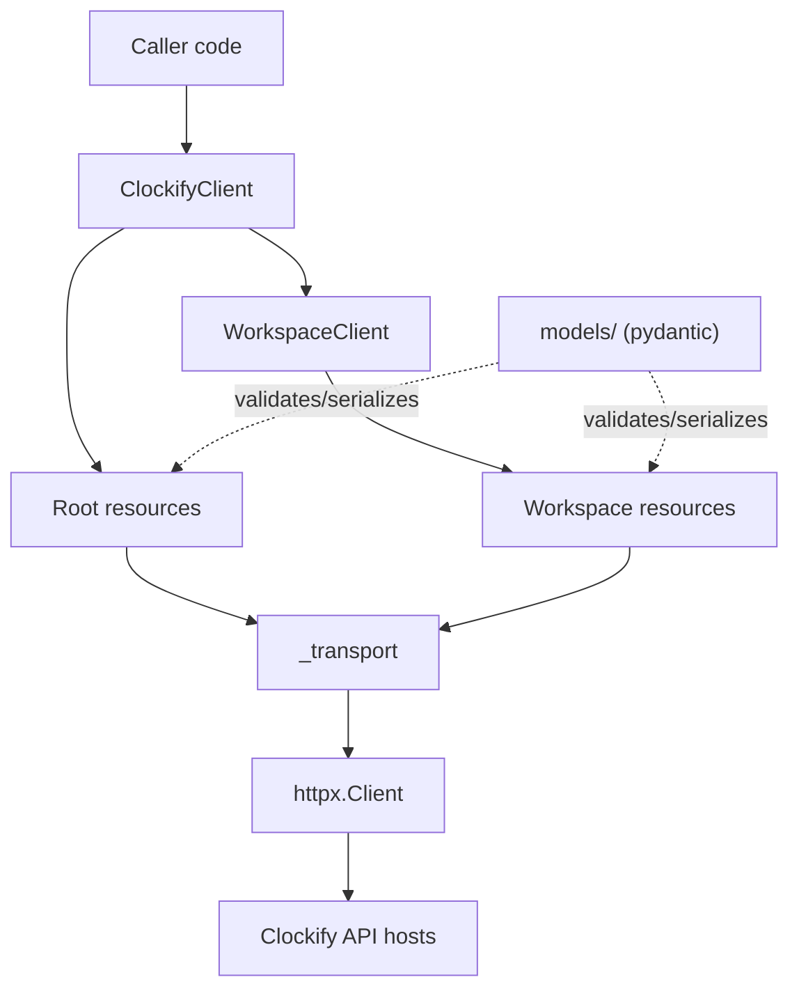
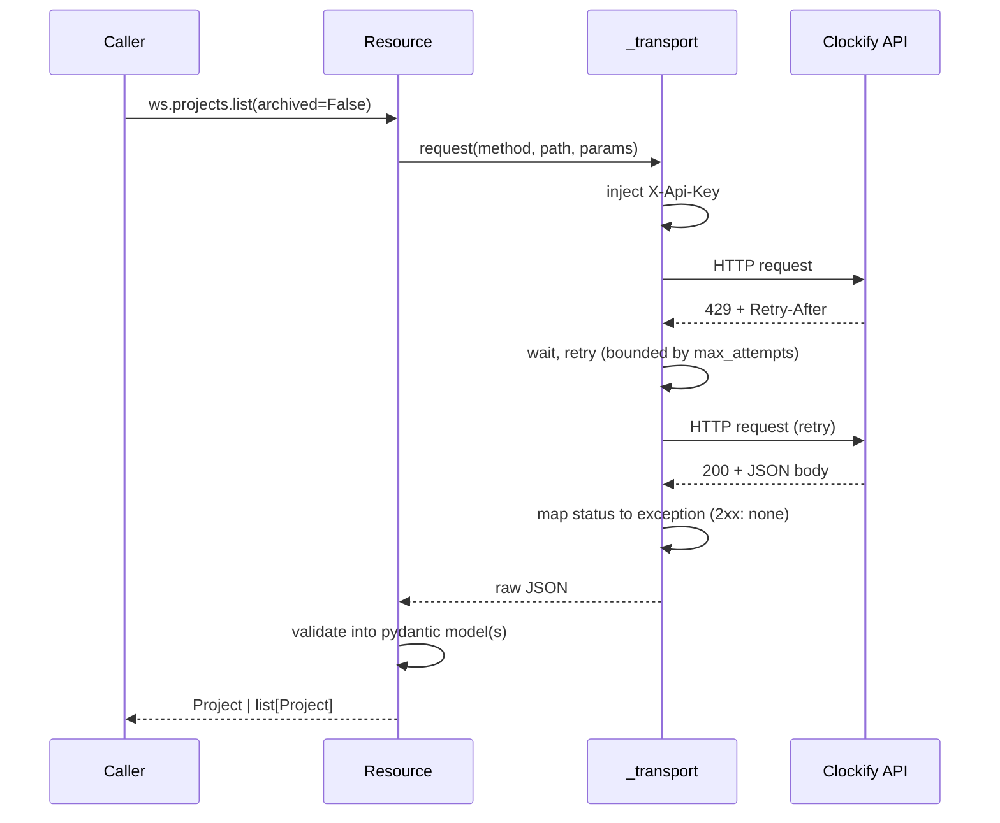
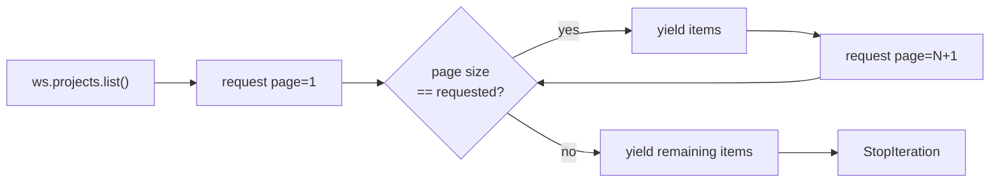

# Architecture

This document describes how the SDK is layered, why it is layered that way,
and the process for adding a new Clockify endpoint. See
[`coverage.md`](coverage.md) for the endpoint-to-method mapping.

## Layering

`ClockifyClient` owns one `httpx.Client` and exposes root-level namespaces
(`user`, `workspaces`) plus `workspace(id)`, which returns a `WorkspaceClient`
bound to that workspace. Resource objects (`projects`, `tasks`, `time_entries`,
...) hang off both clients and never touch `httpx` directly — every request
goes through `_transport`, which owns auth, retries, and error mapping.
`models/` is used by every layer above transport to validate and serialize
payloads.

## Request lifecycle

Every request passes through the same auth → retry → error-mapping →
validation pipeline, regardless of which resource issued it. The retry loop on
`429`/`5xx` and the status-to-exception mapping are the two behaviors worth
tracing explicitly — everything else in this flow is a straight pass-through.

## Pagination

Clockify collection endpoints are offset-paginated (`page`, `page-size`).
`list()` hides that behind a lazy iterator; `list_page()` exposes one page at
a time for callers that want to manage their own cursor.

## Docstring policy and endpoint reference

This repository enforces `app-no-docstrings` (see `README.md`), so IDE hover
text does not carry endpoint information. Instead:

- every resource method has a `# METHOD /path` comment directly above its
  `def`, naming the exact Clockify endpoint it calls;
- `coverage.md` is the authoritative table of every documented Clockify
  endpoint, the SDK method that covers it, and its implementation status.

## Adding a new endpoint

1. Add or extend the pydantic model(s) in `src/clockify/models/`. Read models
   and write models (`XCreate`/`XUpdate`) are separate types; write models
   must not carry server-assigned fields.
2. Add the method to the relevant resource in `src/clockify/resources/`,
   following the CRUD naming contract (`list`/`list_page` → `get` → `create`
   → `update` → `delete`, each returning the corresponding model). Prefix it
   with a `# METHOD /path` comment.
3. Declare the method's CQS kind — query, idempotent command, or
   non-idempotent command. The retry transport reads it to decide `5xx`
   eligibility, so getting it wrong either strips retry protection from a
   read or risks duplicating a write. Reports are queries despite being
   `POST`.
4. Add a unit test in `tests/unit/` asserting the exact HTTP method, path,
   query parameters, and body the method produces (respx).
5. Update `coverage.md`: flip the endpoint's status to `done` and link the
   method.
6. Run `make check && make test` before committing.

## Release checklist

There is no CI for this repository (accepted trade-off — a missed local hook
can ship a broken release). Before tagging a release:

1. `make check` — must exit 0.
2. `make test` — must exit 0, coverage gate (90%) must pass.
3. `uv build` — must produce a valid sdist and wheel.
4. Confirm `coverage.md` reflects the endpoints actually shipped in this
   version.
5. Tag and publish.
