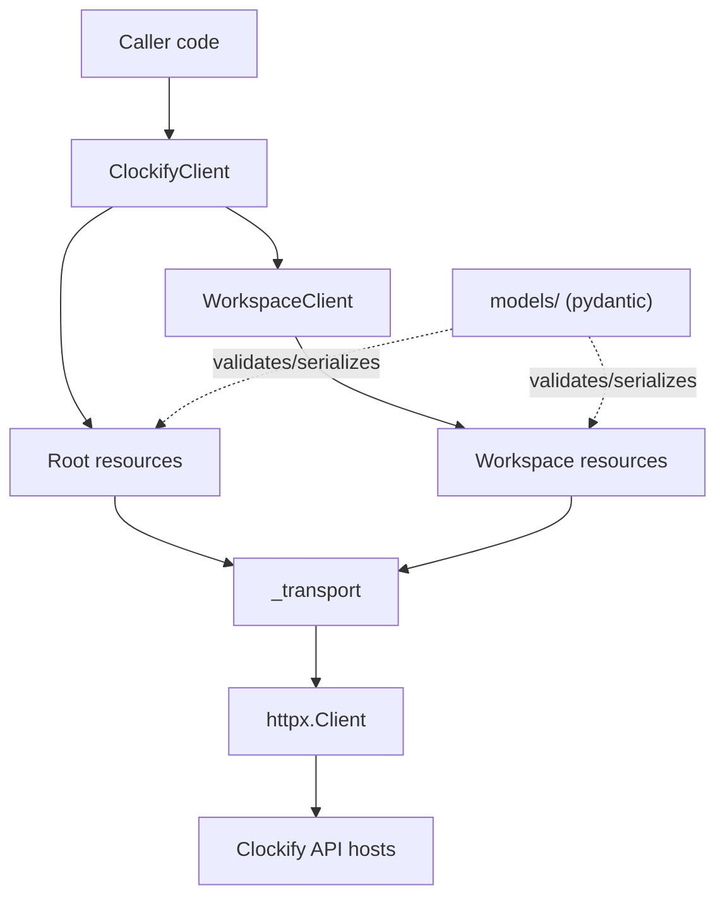

# SDK layering

`ClockifyClient` owns one `httpx.Client` and exposes root-level namespaces
(`user`, `workspaces`) plus `workspace(id)`, which returns a `WorkspaceClient`
bound to that workspace. Resource objects (`projects`, `tasks`,
`time_entries`, ...) hang off both clients and never touch `httpx` directly —
every request goes through `_transport`, which owns auth, retries, and error
mapping. `models/` is used by every layer above transport to validate and
serialize payloads.

`AsyncClockifyClient` mirrors this layering on `httpx.AsyncClient`: it owns an
`AsyncTransport`, hands out `AsyncWorkspaceClient` and async resources with the
same names, and reuses the models, auth and error mapping — see
[`async-client.md`](async-client.md).

See [`request-lifecycle.md`](request-lifecycle.md) for what happens inside
`_transport`, and [`adding-an-endpoint.md`](adding-an-endpoint.md) for the
procedure that extends this layering with a new endpoint.
