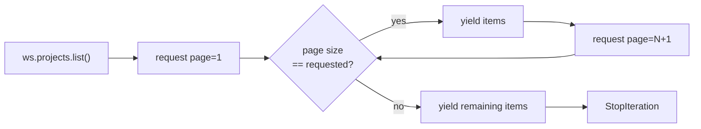

# Offset pagination

Clockify collection endpoints are offset-paginated (`page`, `page-size`).
`list()` hides that behind a lazy iterator; `list_page()` exposes one page at
a time for callers that want to manage their own cursor.

## Page-size maximum

The real per-endpoint `page-size` maximum is unconfirmed; reported values
range from 200 to 5000. The iterator does not depend on it: it stops on the
first page shorter than the requested size, so a server that silently caps
`page-size` below the requested value would end iteration early. Pass an
explicit `page_size` at or below the confirmed limit if that matters.
