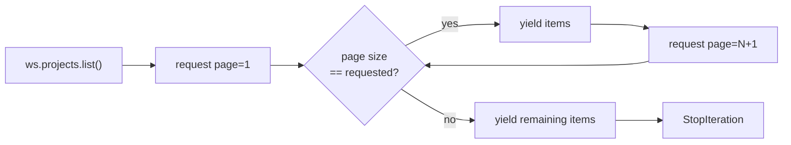

# Offset pagination

Clockify collection endpoints are offset-paginated (`page`, `page-size`).
`list()` hides that behind a lazy iterator; `list_page()` exposes one page at
a time for callers that want to manage their own cursor.

