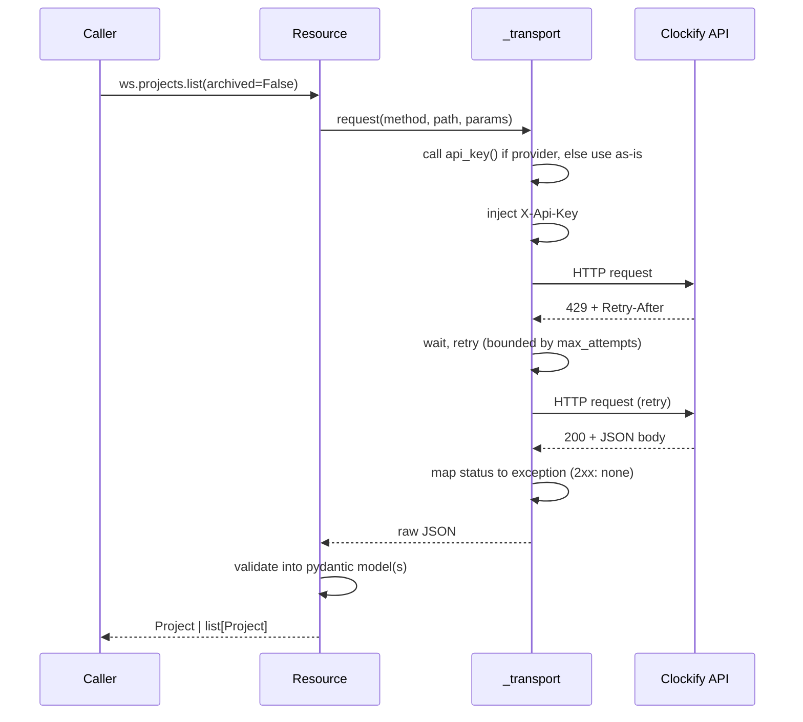

# Request lifecycle

Every request passes through the same auth → retry → error-mapping →
validation pipeline, regardless of which resource issued it. The retry loop
on `429`/`5xx` and the status-to-exception mapping are the two behaviors
worth tracing explicitly — everything else in this flow is a straight
pass-through.

Declaring a resource method's CQS kind (query, idempotent command,
non-idempotent command) is part of adding an endpoint — see
[`adding-an-endpoint.md`](adding-an-endpoint.md) — because the retry
transport reads it to decide `5xx` eligibility.

The async client runs the same pipeline: `AsyncTransport` awaits the request,
`AsyncRetryTransport` retries with `asyncio.sleep`, and response handling is the
same function — see [`async-client.md`](async-client.md).
